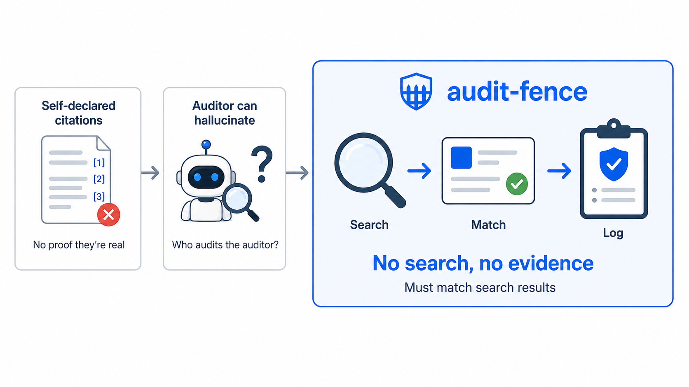
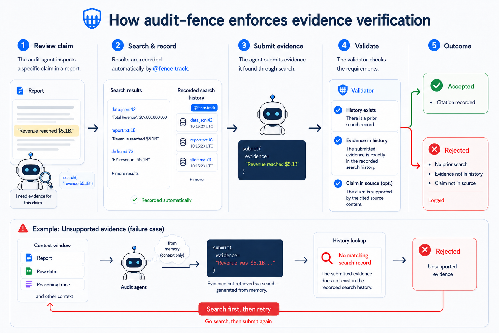

# audit-fence

**Trace every claim to its source. Identify every hallucination. Before the report reaches your client.**

Every AI agent system hallucinates — regardless of model, framework, or prompt engineering. audit-fence provides automated hallucination detection and source citation for any orchestration pipeline. Model-agnostic, framework-compatible, with a pre-built audit agent that runs out of the box.

<p>
  
  
  
</p>

---

<p align="center">
  
</p>

## The Problem

Every industry is deploying AI agent systems to generate reports — financial analysis, legal review, medical assessment. These agents cite sources. The question compliance teams ask:

**"Can you prove each citation actually comes from the source data?"**

The answer, today, is usually no. Agents fabricate evidence — they produce citations that look right but don't match anything in the source document. The citations are assertions, not verifiable links. For a blog post, that's fine. For a financial report that a compliance officer must sign off on, it's not.

Recent [mechanistic analysis of transformer internals](https://doi.org/10.1007/978-3-032-21324-2_35) confirms why: LLM citation decisions rely on shallow heuristics like entity name co-occurrence — the model matches surface patterns rather than genuinely verifying the cited source supports the claim.

---

## How It Works

Your agent system generates a report. A separate **audit agent** — any LLM you choose — reviews that report against the underlying source data and, optionally, the reasoning traces from your pipeline. audit-fence **programmatically constrains** every tool this audit agent operates with. By requiring a targeted `search()` before every evidence submission, it forces relevant source material to the **tail of the context window** — where transformer attention is strongest — rather than relying on what the agent "remembers" from the middle of a long context, where hallucination is most likely. This infrastructure-level design maximally compresses the probability of the audit agent itself fabricating evidence.

The approach has been [systematically evaluated](#proven-effective) on real-world financial documents with deterministic ground truth, confirming its precision and reliability as an automated audit system.

The core rule: **you cannot record a citation unless it matches data you actually searched for.** One rule, enforced by code.

```
Without enforcement:
  Audit Agent → "I found X in the data"  →  Record  →  ✓ accepted (unverified)

With audit-fence (happy path):
  Audit Agent → search(query)             →  Result saved to tracked history
  Audit Agent → submit(                   →  Validation Gate
                 claim,                        ✓ search history exists?
                 claim_in_document,            ✓ evidence long enough?
                 evidence,                     ✓ evidence ∈ search history?
                 finding, ...                  ✓ claim in document?
               )                          →  Accepted

With audit-fence (hallucination caught):
  Audit Agent → submit(                   →  Validation Gate
                 claim,                        ✗ no search history!
                 claim_in_document,            ✗ text not in document!
                 evidence="revenue was...",    ✗ fabricated — not from any search!
               )                          →  REJECTED (agent must retry)
```

Minimal integration. Full traceability. Model-agnostic. Four validation checks, pre-built audit agent.

<p align="center">
  
</p>

**Search** — point audit-fence at your source data directory (where your production system's outputs and trace files are stored) and the audit agent searches them claim by claim using [ripgrep](https://github.com/BurntSushi/ripgrep). Results are automatically tracked for enforcement.

**Evidence submission** — `create_record_tool()` gives you a fully configured submission tool out of the box: enforcement checks, structured `ClaimRecord` output, and auto-persistence to JSONL.

Before each submission executes, the fence validates:

| Check | What it validates | On failure |
|-------|------------------|------------|
| **Search history** | Recent search history is not empty — the agent must have searched before submitting | Rejected: "No search calls recorded" |
| **Evidence length** | Evidence meets minimum length (`min_evidence_length`, default 20) | Rejected: "Evidence too short" |
| **Evidence match** | Submitted evidence is a verbatim substring of a recent search result — this is the core enforcement that ties each submission to a specific search output | Rejected: "Evidence does not match any recent search result" |
| **Claim in document** | The agent must specify which verbatim text in the report it is auditing — verified as an exact substring of the document provided via `set_document()` | Rejected: "Claim text not found in the source document" |

If any check fails, the submission is **blocked** and the agent is asked to retry. Every rejection is logged for audit review.

### Why this works

Forcing a search before each evidence submission exploits a known property of transformer attention. When an audit agent's context window is packed with report, source data, and reasoning traces, **information in the middle is most prone to hallucination** — the "[lost in the middle](https://arxiv.org/abs/2307.03172)" effect. By requiring a `search()` call before every `submit()`, audit-fence forces the relevant evidence to the **tail of the context window** — where attention is strongest and hallucination is least likely.

The enforcement doesn't just catch fabrication after the fact; it **structurally reduces the conditions under which fabrication occurs**.

---

## Quick Start

```bash
pip install audit-fence langgraph langchain-openai
```

```python
from audit_fence import Fence
from langchain_openai import ChatOpenAI

fence = Fence()
fence.set_document(open("report.md").read())    # the report being audited
fence.set_source("./source_data/")              # where to search (uses ripgrep)
fence.set_output("audit/citations.jsonl")       # auto-persist every record

result = await fence.audit(llm=ChatOpenAI(model="gpt-4o", temperature=0.1))

print(f"{result.summary['total']} claims audited")
print(f"{result.summary.get('found', 0)} found, {result.summary.get('not-found', 0)} not found")
print(f"{len(result.rejections)} enforcement rejections")
```

Works with any LangChain-compatible model:

```bash
pip install langgraph langchain-anthropic   # for Claude
pip install langgraph langchain-openai      # for GPT
pip install langgraph langchain-community   # for DeepSeek, Ollama, etc.
```

```python
from langchain_anthropic import ChatAnthropic
result = await fence.audit(llm=ChatAnthropic(model="claude-sonnet-4-20250514"))
```

See [`examples/`](examples/) for complete, runnable scripts including a [financial report audit](examples/financial_report.py) and [LangGraph integration](examples/langchain_agent.py).

---

## Proven Effective

Tested on SEC 10-K filings (45K–243K tokens) with deterministic XBRL ground truth — no LLM judges, no human annotation, no evaluation circularity.

<!-- Benchmark results, charts, and methodology link will be added after benchmark completion -->

---

## Designed For

**Financial services** — Agent systems generating investment analysis, risk reports, compliance reviews. Every number traceable to SEC filings, market data feeds, or internal databases.

**Legal** — Automated contract review, regulatory compliance checking. Every statute citation verified against the actual legal text.

**Life sciences** — Clinical trial summaries, drug interaction reports. Every data point linked to the original study or FDA filing.

Any domain where an AI-generated report must withstand regulatory scrutiny.

---

## Integration

For the simplest path, use `fence.audit()` — see [Quick Start](#quick-start). The sections below cover manual integration for custom agents and pipelines.

The core enforcement engine has no required dependencies. The pre-built audit agent (`fence.audit()`) uses LangGraph — install the model provider you prefer. For custom integration, audit-fence provides `wrap_tools()` for existing tool lists and decorators for new projects.

### Configuration

```python
fence = Fence(
    name="audit_r1",          # Optional identifier (for multi-agent, logging)
    min_evidence_length=20,   # Minimum chars for evidence (default: 20)
    history_window=20,        # How many recent searches to check against (default: 20)
    history_limit=100,        # Max total records kept in memory (default: unlimited)
    context={"ticker": "AAPL", "phase": "audit"},  # Attached to every rejection log entry
    track_all=False,          # When True, wrap_tools() tracks ALL tools (see Soft Enforcement)
)
```

#### Setup methods

After constructing a Fence, configure what it audits:

```python
fence.set_document(open("report.md").read())  # the report being audited
fence.set_source("./source_data/")            # where to search (creates a RipgrepBackend)
fence.set_output("audit/citations.jsonl")     # auto-persist every ClaimRecord
```

`set_document()` enables automatic `claim_in_document` verification. `set_source()` creates a tracked search tool (available as `fence.search`). `set_output()` auto-appends records to JSONL. All three accept callables for dynamic content — see individual sections below.

#### Custom parameter names

```python
@fence.enforce(evidence_param="grep_output")
def submit(claim: str, grep_output: str) -> dict: ...
```

#### Source text verification (per-decorator alternative)

If you prefer decorator-level configuration instead of `set_document()`, you can pass `source_text` directly to `@fence.enforce`:

```python
report = open("report.md").read()

@fence.enforce(claim_param="claim_in_report", source_text=report)
def submit(claim_in_report: str, evidence: str) -> dict: ...
```

`source_text` can be a callable for dynamic content:

```python
@fence.enforce(claim_param="claim", source_text=lambda: load_latest_report())
def submit(claim: str, evidence: str) -> dict: ...
```

#### Document enforcement

`set_document()` tells the fence which document is being audited. Any function with a `claim_in_document` parameter is automatically checked — the value must be a verbatim substring of the document (after markdown normalization):

```python
fence = Fence()
fence.set_document("The company reported revenue of $5.1 billion in FY2025.")

@fence.track
def search(query: str) -> str: ...

@fence.enforce
def record(claim: str, claim_in_document: str, evidence: str) -> dict:
    return {"claim": claim, "status": "ok"}

search("revenue")
record(
    claim="Revenue was $5.1B",
    claim_in_document="revenue of $5.1 billion",    # found in document
    evidence="<matching search output>",
)
record(
    claim="Revenue was $5.1B",
    claim_in_document="revenue of $8.2 billion",    # not in document
    evidence="<matching search output>",
)
# => ERROR: 'revenue of $8.2 billion' not found in the audited document
```

Callable documents are supported for dynamic content:

```python
fence.set_document(lambda: open("report.md").read())
```

#### Rejection logging

Every rejected submission is recorded:

```python
fence.rejections
# [{"tool": "record_citation", "content": "...", "reason": "...", "timestamp": ..., "context": {...}}]

fence.save_log("enforcement_log.jsonl")
```

### wrap_tools() — for existing codebases

If you already have tools defined, `wrap_tools()` adds enforcement without modifying any function definitions:

```python
from audit_fence import Fence

fence = Fence()

# Your existing tools — no changes needed
existing_tools = [search_web, get_financials, analyze_data, write_report]

# One call: classify by name pattern, get back enforced tools
protected_tools = fence.wrap_tools(
    existing_tools,
    search=["search_*", "get_*"],     # these get tracked
    submit=["write_*"],               # these get enforced
)

agent = create_react_agent(llm, protected_tools)
```

Tools matching `search` patterns are tracked. Tools matching `submit` patterns are enforced. Unmatched tools pass through unchanged. You can also match by function reference:

```python
protected_tools = fence.wrap_tools(
    existing_tools,
    search=[search_web, get_financials],
    submit=[write_report],
)
```

### Decorators — for new projects

When building tools from scratch, decorators express intent at the definition site:

```python
from langchain_core.tools import tool
from audit_fence import Fence

fence = Fence()

@tool
@fence.track
def search_evidence(query: str, path: str = "traces/") -> str:
    """Search trace files for evidence."""
    return subprocess.run(["rg", "-n", query, path], capture_output=True, text=True).stdout

@tool
@fence.enforce
def record_citation(claim: str, evidence: str) -> str:
    """Record a citation. evidence must match a recent search result."""
    return json.dumps({"claim": claim, "status": "recorded"})

agent = create_react_agent(llm, [search_evidence, record_citation])
```

When the agent submits invalid evidence, the tool returns `"ERROR: ..."`. The ReAct loop sees this as a failed tool call and retries — naturally driving the agent toward valid, search-backed evidence.

### OpenAI / Anthropic / Custom

The decorated functions are regular callables. Use them in your tool dispatch however your framework requires:

```python
# OpenAI function calling — use your framework's schema helper
tools_schema = [describe_function(fn) for fn in fence.tools]

# Any custom framework
for fn in fence.tools:
    register_tool(fn.__name__, fn, fn.__doc__)
```

### DeepSeek (reasoning models)

DeepSeek's reasoning models (R1, V3, V4 Flash) return a `reasoning_content` field that must be passed back in all subsequent API requests. LangChain's `ChatOpenAI` silently drops this field during serialization, causing 400 errors on multi-turn conversations. This is an [open upstream bug](https://github.com/langchain-ai/langchain/issues/34166) (6+ months unresolved as of May 2026).

audit-fence provides a drop-in replacement:

```python
from audit_fence.compat import ChatOpenAIDeepSeek

llm = ChatOpenAIDeepSeek(
    model="deepseek-reasoner",
    api_key="...",
    base_url="https://api.deepseek.com",
    extra_body={"thinking": {"type": "enabled"}},
)

# Works with fence.audit() and create_react_agent()
result = await fence.audit(llm=llm)
```

`ChatOpenAIDeepSeek` fixes two classes of 400 errors: missing `reasoning_content` round-trip and unmatched `tool_call_id`s from invalid tool call arguments. When LangChain merges an upstream fix, replace with plain `ChatOpenAI` — the interface is identical.

---

## Structured Claims

The core `@fence.track` / `@fence.enforce` decorators work with any function signature. For audit workflows that produce structured claim records — with findings, source provenance, and evidence chains — audit-fence provides a higher-level API.

### ClaimRecord

A dataclass that links a document statement to its source evidence:

```python
from audit_fence import ClaimRecord

record = ClaimRecord(
    claim="P/E ratio of 18.9x",                          # what's being verified
    claim_in_document="the stock trades at 18.9x P/E",   # verbatim text from audited document
    evidence="fundamental.json:18: pe_ratio: 18.923",    # search output that supports it
    source_tool="get_stock_info",                         # which tool produced the source data
    source_index=0,                                       # tool call index
    raw_value="18.923",                                   # exact value from source
    finding="found",                                      # agent-assigned (no built-in taxonomy)
    source_type="standard",                               # standard | kb | web | computation | custom
)
```

All fields except `claim`, `claim_in_document`, and `evidence` are optional. IDs auto-increment. Serialize with `record.to_dict()`.

### create_record_tool

Factory function that creates an enforcement-checked record tool — combines `@fence.enforce` with `ClaimRecord` creation and JSONL persistence:

```python
from audit_fence import Fence, create_record_tool

fence = Fence()
fence.set_document(report_text)
fence.set_output("audit/citations.jsonl")   # auto-append each record

record = create_record_tool(
    fence,
    name="record_citation",
    extra_fields=["finding", "source_tool", "raw_value", "grep_file", "grep_line"],
)

# Usage: search first, then record
search("revenue")
result = record(
    claim="Revenue was $5.1B",
    claim_in_document="revenue of $5.1 billion",
    evidence="fundamental.json:42: totalRevenue: 5098000000",
    finding="found",               # known field -> ClaimRecord.finding
    source_tool="get_stock_info",   # known field -> ClaimRecord.source_tool
    raw_value="5098000000",         # known field -> ClaimRecord.raw_value
    grep_file="fundamental.json",   # unknown field -> ClaimRecord.metadata["grep_file"]
    grep_line=42,                   # unknown field -> ClaimRecord.metadata["grep_line"]
)
# result is a ClaimRecord instance
# also auto-appended to audit/citations.jsonl
```

`extra_fields` that match `ClaimRecord` attributes are set directly on the record. Unrecognized fields are routed to the record's `metadata` dict.

### Conditional enforcement

Sometimes certain record types should bypass search enforcement — a "not-found" finding doesn't have evidence to match, a "kb" source type comes from a knowledge base rather than a search.

**Dict form** — skip when any field matches a listed value:

```python
record = create_record_tool(
    fence,
    extra_fields=["finding"],
    skip_enforcement={"finding": ["not-found", "derived"]},
)

# Multiple fields — skip if ANY matches
record = create_record_tool(
    fence,
    extra_fields=["finding", "source_type"],
    skip_enforcement={
        "finding": ["not-found"],
        "source_type": ["kb", "web"],
    },
)
```

**Callable form** — full flexibility:

```python
record = create_record_tool(
    fence,
    skip_enforcement=lambda kw: kw.get("confidence", 0) > 0.9,
)
```

Document enforcement (`claim_in_document` vs `set_document()`) is always checked regardless of skip.

### Record enrichment

The `enrich` callback runs after a `ClaimRecord` is created but before it's persisted. Return the record to accept, or `None` to reject:

```python
def resolve_source(record: ClaimRecord) -> ClaimRecord | None:
    """Auto-resolve tool name from grep coordinates."""
    if record.search_file and record.search_line >= 0:
        tool, idx = my_trace_resolver(record.search_file, record.search_line)
        record.source_tool = tool
        record.source_index = idx
    else:
        return None  # reject — can't resolve source provenance
    return record

record = create_record_tool(
    fence,
    extra_fields=["search_file", "search_line"],
    enrich=resolve_source,
)
```

When `enrich` returns `None`, the record is not persisted. The rejection is logged and triggers `on_reject`.

### Lifecycle callbacks

```python
record = create_record_tool(
    fence,
    on_record=lambda r: print(f"Recorded #{r.id}: {r.finding} — {r.claim[:50]}"),
    on_reject=lambda tool, content, reason: log.warning(f"[{tool}] {reason}"),
)
```

`on_record` fires after successful creation, enrichment, and persistence. `on_reject` fires on any rejection. Both are optional.

### Evidence chain

In multi-stage pipelines, claims in later stages trace back to claims from earlier stages:

```python
from audit_fence import FenceGroup, create_record_tool

group = FenceGroup()
r1 = group.create("r1_fundamental")
r2 = group.create("r2_specialist")

# R1 records a claim
rec_r1 = create_record_tool(r1, name="record_r1_claim", ...)
search_r1("pe_ratio")
r1_claim = rec_r1(claim="P/E of 18.9x", ...)

# R2 links back to R1 via enrich
def link_to_r1(record):
    best_match = find_nearest(r1.claims, record)
    if best_match:
        record.upstream_id = best_match.id
        record.upstream_fence = "r1_fundamental"
    return record

rec_r2 = create_record_tool(r2, name="record_r2_claim", enrich=link_to_r1, ...)

# Traverse the full chain
chain = group.trace_chain(r2_claim)
# [r2_claim, r1_claim] — from final claim back to source
```

`trace_chain()` is cycle-safe and works with arbitrarily long pipelines.

---

## Multi-Agent Enforcement

A single Fence works for one agent. Production systems often have multiple agents — specialists that search, a synthesizer that writes, an auditor that verifies. **`fence.link(upstream)`** declares "this fence can cite evidence from that fence's history."

### Hierarchical — manager cites workers

```python
from audit_fence import Fence

worker_a = Fence(name="worker_a")
worker_b = Fence(name="worker_b")
manager = Fence(name="manager")

manager.link(worker_a, worker_b)

# Workers search independently
tools_a = worker_a.wrap_tools(worker_a_tools, search=["search_*"])
tools_b = worker_b.wrap_tools(worker_b_tools, search=["search_*"])

# Manager validates against its own history PLUS both workers'
manager_tools = manager.wrap_tools(
    [search_summary, write_report],
    search=["search_*"],
    submit=["write_*"],
)
```

### Pipeline — transitive evidence flow

```python
researcher = Fence(name="researcher")
enricher = Fence(name="enricher")
reporter = Fence(name="reporter")

enricher.link(researcher)    # enricher can cite researcher
reporter.link(enricher)      # reporter can cite enricher AND researcher (transitive)
```

Links are transitive. Each stage validates against the accumulated history of all preceding stages.

### Production — multi-specialist audit (Firn)

A real-world topology from [Firn](https://github.com/M-HuangX/Firn), the financial analysis system audit-fence was extracted from:

```python
from audit_fence import Fence, FenceGroup

group = FenceGroup()

# Specialist agents (each searches independently)
fund = group.create("fundamental")
tech = group.create("technical")
value = group.create("value")
macro = group.create("macro")

# R1 audit: each auditor is restricted to one specialist
r1_fund = group.create("r1_fundamental")
r1_fund.link(fund)     # can only cite fundamental's searches

r1_tech = group.create("r1_technical")
r1_tech.link(tech)     # can only cite technical's searches

# R2 audit: cross-specialist verification
r2 = group.create("r2_specialist")
r2.link(fund, tech, value, macro)   # can cite all four

# Unified view
group.save_log("audit/enforcement_log.jsonl")
```

Each R1 auditor is **isolated** to its specialist. The R2 auditor intentionally sees all four. The topology encodes the audit policy.

### Path sandboxing

Different agents should be restricted to different data sources. `SandboxedSearch` wraps a search backend with path restrictions:

```python
from audit_fence import SandboxedSearch

search_a = SandboxedSearch(
    backend=grep_backend,
    allowed_dirs=["trace/specialist_outputs/"],
)

search_b = SandboxedSearch(
    backend=grep_backend,
    allowed_dirs=["tools/"],
    allowed_files=["report.md"],
)

search_a("revenue", "trace/specialist_outputs/fund.md")   # allowed
search_a("revenue", "tools/data.json")                     # => ERROR: outside sandbox
```

Path traversal (e.g., `tools/../secret/data.json`) is automatically blocked.

### RipgrepBackend

A ready-to-use search backend wrapping the `rg` CLI via subprocess:

```python
from audit_fence import RipgrepBackend, SandboxedSearch, Fence

fence = Fence()

grep = RipgrepBackend(root="./trace/")
search = fence.wrap_tool(grep, role="search")

# With sandbox
sandboxed = SandboxedSearch(backend=grep, allowed_dirs=["tools/"])
search = fence.wrap_tool(sandboxed, role="search")
```

Requires `rg` (ripgrep) installed on the system — no Python dependencies added.

### FenceGroup

Optional convenience for managing multiple fences:

```python
group = FenceGroup()
fund = group.create("fundamental", min_evidence_length=20)
tech = group.create("technical", min_evidence_length=20)

group["fundamental"].rejections       # named access
group.all_rejections                  # sorted across all fences
group.all_claims                      # all ClaimRecords
group.save_log("audit.jsonl")         # combined log
group.reset()                         # reset all

chain = group.trace_chain(some_claim) # evidence chain traversal
```

---

## Soft Enforcement

Not every agent has explicit submit tools. Some agents search, reason, and produce a final text response. For these, audit-fence provides **soft enforcement**: track all tool calls, then validate the output after the fact.

```python
from audit_fence import Fence

fence = Fence(track_all=True)
tools = fence.wrap_tools(existing_tools)

agent = create_react_agent(llm, tools)
result = await agent.ainvoke({"messages": [HumanMessage(content="Analyze AAPL")]})

report = result["messages"][-1].content
validation = fence.validate_output(report)
```

`validate_output` extracts quoted passages from the text and checks each against search history:

```python
validation.found       # ["revenue was $5.1B in FY2025", ...]
validation.not_found   # ["fabricated quote not in history", ...]
validation.coverage    # 0.85 (fraction of quotes that matched)
validation.ok          # True if all quotes matched
validation.total       # total number of quoted passages examined
```

Works with multi-agent topologies — `validate_output` traverses upstream links.

---

## Snapshot — Production Trace Capture

In production, your agent system generates reports using its own tools — API calls, database queries, search results. **Snapshot** captures every tool call output as grep-friendly trace files, so the audit agent can search and verify them.

```
Production pipeline                     Audit
┌──────────────────────────┐            ┌───────────────────────────┐
│  Agent calls tools       │            │  fence.set_source(trace/) │
│  snap captures output    │──trace/──> │  fence.audit(llm=...)     │
│  snap.finalize()         │            │  → grep trace files       │
└──────────────────────────┘            └───────────────────────────┘
```

### LangGraph (zero-config)

```python
from audit_fence import Fence, Snapshot

# 1. Capture production tool calls
snap = Snapshot("trace/")
result = await agent.ainvoke(input, config=snap.config(agent="research"))
snap.finalize()

# 2. Audit against captured data
fence = Fence()
fence.set_document(final_report)
fence.set_source(snap.trace_dir)
audit = await fence.audit(llm=llm, manifest=snap.load_manifest())
```

`snap.config()` injects a LangGraph callback handler — no tool modification needed. Every tool call is saved as a flat text file under `trace/research/calls/` plus a structured JSONL index.

### Trace file format

Each tool call produces a grep-friendly text file:

```
trace/
├── research/
│   ├── calls/
│   │   ├── 0000_get_financials.txt    # flat text, one file per call
│   │   ├── 0001_search_filings.txt
│   │   └── 0002_analyze_data.txt
│   └── tool_calls.jsonl               # structured index
└── manifest.json                       # agent topology + tool stats
```

The flat text files are formatted for grep: `dict` → `key: value` lines, `list[dict]` → ASCII table, `str` → as-is. Output is capped at 10MB per file (configurable).

### Manifest-guided audit

`snap.finalize()` writes `manifest.json` with agent topology, tool statistics, and trace paths. Pass it to `fence.audit()` to inject this context into the audit agent's system prompt:

```python
audit = await fence.audit(llm=llm, manifest=snap.load_manifest())
```

### Multi-agent capture

```python
snap = Snapshot("trace/")

# Capture each agent separately
result_a = await agent_a.ainvoke(input, config=snap.config(agent="fundamental"))
result_b = await agent_b.ainvoke(input, config=snap.config(agent="technical"))

# Declare dependency graph
snap.declare_dependency("synthesizer", upstream=["fundamental", "technical"])
result_c = await agent_c.ainvoke(input, config=snap.config(agent="synthesizer"))

snap.finalize()

# Build audit topology from manifest
group = FenceGroup.from_snapshot_manifest(
    snap.load_manifest(),
    trace_root="trace/",
)
```

`FenceGroup.from_snapshot_manifest()` creates per-agent fences with links matching the declared dependencies.

### Alternative integration (non-LangGraph)

```python
# Decorator
@snap.capture(agent="research")
def get_stock_price(ticker: str) -> dict:
    return api.get(f"/stock/{ticker}")

# Wrap existing tools
wrapped = snap.wrap([tool_a, tool_b], agent="research")
```

### Built-in redaction

API keys matching common patterns (`sk-*`, `AIza*`, `tvly-*`, `Bearer *`) are automatically redacted. Add custom redaction:

```python
def my_redact(tool_name, input_data, output_data):
    # scrub PII, internal URLs, etc.
    return clean_input, clean_output

snap = Snapshot("trace/", redact=my_redact)
```

Set `redact=False` to disable all redaction.

### Context manager

```python
with Snapshot("trace/") as snap:
    result = await agent.ainvoke(input, config=snap.config(agent="research"))
# finalize() called automatically; marks incomplete on exception
```

---

## Persistence

Fence state can be serialized for audit trails that survive process restarts.

### Single fence

```python
import json

state = fence.snapshot()
with open("fence_state.json", "w") as f:
    json.dump(state, f)

restored = Fence.restore(json.load(open("fence_state.json")))
```

### FenceGroup — preserves links

```python
state = group.snapshot()
with open("group_state.json", "w") as f:
    json.dump(state, f)

restored_group = FenceGroup.restore(json.load(open("group_state.json")))
```

The snapshot captures search history, rejections, configuration, and link topology.

---

## Examples

| Example | Description |
|---------|-------------|
| [`minimal.py`](examples/minimal.py) | Core pattern in 15 lines |
| [`financial_report.py`](examples/financial_report.py) | Financial report audit with source text verification |
| [`langchain_agent.py`](examples/langchain_agent.py) | Integration with LangGraph / LangChain |
| [`multi_agent_audit.py`](examples/multi_agent_audit.py) | Multi-stage pipeline: tool call annotation, evidence chains, enrich rejection, callbacks |

## Scope and Limitations

Honesty about what a tool does and doesn't do matters — especially in compliance contexts.

| | Status | Detail |
|---|---|---|
| **Prevents fabrication** | Solved | The auditor cannot record evidence it never searched for. Submission without a matching search result is programmatically rejected. |
| **Improves attribution accuracy** | Improved | Forcing a targeted search per claim is structurally better than matching against an entire static document — the search result is specific to the claim being verified. |
| **Guarantees correct attribution** | Not yet solved | The agent could still pick the wrong match from valid search results — a passage that is real but corresponds to a different claim. audit-fence reduces it; it does not eliminate it. |
| **Proves causality** | Open research | Tracing a number to its source proves *where* it came from, not *why* it was used or whether the reasoning is sound. |

audit-fence provides a **verifiable enforcement layer** — a necessary foundation that other verification methods (semantic matching, causal reasoning) can build on top of.

## How It Compares

audit-fence operates in the same paradigm as academic fact verification systems — decompose claims, retrieve evidence, verify against source. The difference is in enforcement mechanism and ground truth.

| | FActScore | RAGAS | FEVER | **audit-fence** |
|---|---|---|---|---|
| **What it does** | Evaluates factual precision | Evaluates RAG faithfulness | Classifies claim veracity | **Detects hallucinations + annotates sources** |
| **Verification** | LLM judge | NLI model | Trained classifier | **Mechanical enforcement** |
| **Source annotation** | No | No | No | **Yes — claim to source data** |
| **Dependencies** | Retriever + LLM | LLM API | Training data | **Zero (core) / LangGraph + any LLM (audit agent)** |
| **Designed for** | Research evaluation | RAG pipeline evaluation | Research benchmark | **Production compliance** |

These approaches are complementary. FActScore and RAGAS evaluate output quality after generation. audit-fence enforces source traceability during generation — different stages, different guarantees.

## Origin

audit-fence is extracted from [**Firn**](https://github.com/M-HuangX/Firn), a multi-agent financial analysis system with a full 3-phase audit pipeline, 1000+ tests, and deterministic verdict assignment. In Firn, the enforcement mechanism is integrated with a financial-domain workflow — specialist agents, trace directories, verdict merging. audit-fence isolates the core enforcement pattern as a standalone, domain-agnostic library.

## License

[MIT](LICENSE) — use it anywhere, no restrictions.
